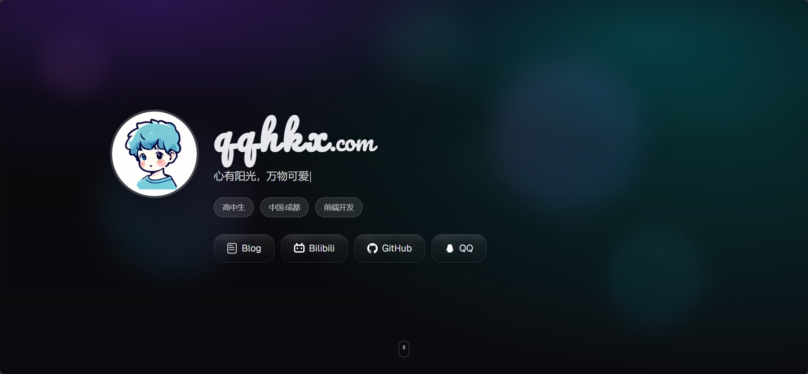

# QQHKX Personal Homepage

English | [中文](./README.md)

A modern personal homepage project built with [Next.js](https://nextjs.org), pursuing "beautiful and stunning" visual and interactive experiences.



## ✨ Features

- 🎨 **Modern Design**: Gradient backgrounds and neumorphism style
- 🎭 **Smooth Animations**: Framer Motion spring animation system
- 📱 **Responsive Design**: Perfect adaptation for all devices
- ⚡ **Next.js 15**: Latest framework with App Router support
- ⚙️ **Environment Configuration**: Zero code modification, pure configuration-driven
- 🚀 **One-click Deployment**: Perfect support for Vercel deployment

## 🚀 Supported Features

### 📋 Personal Information Display
- ✅ **Profile Avatar**: Support for remote image links with automatic loading optimization
- ✅ **Name Display**: Support for custom display names
- ✅ **Personal Motto**: Typewriter effect with character-by-character display
- ✅ **Geographic Location**: Display current city or region
- ✅ **Professional Role**: Show current profession or identity
- ✅ **Personal Bio**: Detailed introduction with template variable support

### 🔗 Social Media Integration
- ✅ **GitHub**: Code repository showcase
- ✅ **QQ**: Instant messaging contact
- ✅ **Bilibili**: Video content sharing
- ✅ **Personal Blog**: Article and thought sharing
- ✅ **Custom Platforms**: Support for adding any social platform
- ✅ **SVG Icons**: Vector icons, perfect for all screen types

### 💻 Skills Showcase
- ✅ **Programming Languages**: Support for multiple programming language tags
- ✅ **Frameworks & Tools**: Display mastered tech stack
- ✅ **Dynamic Tags**: Colorful gradient skill tags
- ✅ **Category Management**: Separate display for languages and tools

### 🎨 Project Portfolio
- ✅ **Project Cards**: Beautiful project showcase cards
- ✅ **Project Description**: Detailed project introductions
- ✅ **Tech Tags**: Technology stack used in projects
- ✅ **External Links**: Support for GitHub, demo sites, and other links
- ✅ **Responsive Grid**: Adaptive project layout

### 🎭 Animations & Interactions
- ✅ **Hero Animation**: Page loading entrance animations
- ✅ **Scroll Parallax**: Background element parallax scrolling effects
- ✅ **Typewriter Effect**: Character-by-character motto display
- ✅ **Hover Effects**: Interactive feedback for buttons and cards
- ✅ **Spring Animations**: Physics-based natural animations
- ✅ **Progressive Loading**: Content enters gracefully in batches

### 🌐 Multi-platform Deployment
- ✅ **Vercel Deployment**: One-click deployment with automatic HTTPS
- ✅ **Netlify Support**: Static site hosting
- ✅ **GitHub Pages**: Free GitHub hosting
- ✅ **Custom Domain**: Support for binding personal domains
- ✅ **CDN Acceleration**: Global content delivery network

### ⚙️ Configuration & Customization
- ✅ **Environment Variable Driven**: Zero code modification, pure configuration
- ✅ **Template Variables**: Support for dynamic content replacement
- ✅ **Theme Customization**: Customizable colors and styles
- ✅ **Font Configuration**: Support for custom font files
- ✅ **Image Domain Configuration**: Flexible image resource management

### 📱 Responsive Design
- ✅ **Mobile Optimization**: Perfect adaptation for phone screens
- ✅ **Tablet Adaptation**: Optimized layout for medium screens
- ✅ **Desktop Experience**: Rich interactions for large screens
- ✅ **Touch Friendly**: Touch optimization for mobile devices

### 🔍 SEO & Performance
- ✅ **Metadata Optimization**: Complete SEO tags
- ✅ **Open Graph**: Social media sharing optimization
- ✅ **Image Optimization**: Next.js Image component automatic optimization
- ✅ **Code Splitting**: On-demand loading for improved performance
- ✅ **Static Generation**: Pre-rendered pages for ultra-fast loading

### 🛠️ Development Experience
- ✅ **TypeScript Support**: Complete type safety
- ✅ **Hot Reload**: Real-time preview during development
- ✅ **ESLint Configuration**: Code quality assurance
- ✅ **Environment Variable Validation**: Configuration error prompts
- ✅ **Development Tools**: Rich debugging and development assistance

## 🔧 Environment Configuration

This project supports dynamic configuration of personal information through environment variables:

1. Copy the environment variable template:
   ```bash
   cp .env.example .env.local
   ```

2. Edit the `.env.local` file and fill in your personal information

3. Restart the development server

For detailed configuration instructions, please refer to [ENV_CONFIG.md](./ENV_CONFIG.md).

## 🚀 Quick Start

1. **Clone the project**
   ```bash
   git clone https://github.com/qqhkx/qqhkx-homepage.git
   cd qqhkx-homepage
   ```

2. **Install dependencies**
   ```bash
   npm install
   ```

3. **Configure environment variables**
   ```bash
   cp .env.example .env.local
   # Edit .env.local file and fill in your personal information
   ```

4. **Start development server**
   ```bash
   npm run dev
   ```

5. **Access the application**
   
   Open [http://localhost:3000](http://localhost:3000) to view the result.

## 📁 Project Structure

```
qqhkx-homepage/
├── src/
│   ├── app/                 # Next.js App Router pages
│   ├── components/          # React components
│   └── lib/                 # Utility functions and configurations
├── public/                  # Static assets
│   └── font/               # Local font files
├── .env.example            # Environment variable template
├── .env.local              # Local environment variables (create yourself)
├── ENV_CONFIG.md           # Environment configuration guide
└── README.en.md            # English documentation
```


## 📦 Build & Deploy

### Local Build
```bash
npm run build
npm start
```

### Deploy to Vercel

1. **One-click deployment**
   
   [](https://vercel.com/new/clone?repository-url=https://github.com/qqhkx/qqhkx-homepage)

2. **Manual deployment**
   ```bash
   # Install Vercel CLI
   npm i -g vercel
   
   # Deploy
   vercel
   ```

3. **Environment variable configuration**
   
   Configure the required environment variables in Vercel Console > Settings > Environment Variables. For detailed configuration, please refer to the [Environment Configuration](#-environment-configuration) section above.

## 📚 Resources

- [Next.js Documentation](https://nextjs.org/docs) - Learn about Next.js features and API
- [Tailwind CSS Documentation](https://tailwindcss.com/docs) - CSS framework documentation
- [Framer Motion Documentation](https://www.framer.com/motion/) - Animation library documentation
- [Vercel Deployment Documentation](https://vercel.com/docs) - Deployment platform documentation

## 📈 Star History

[](https://star-history.com/#qqhkx/qqhkx-homepage&Date)

## 🤝 Contributing

Issues and Pull Requests are welcome!

## 📄 License

[MIT License](LICENSE)

---

⭐ If this project helps you, please give it a Star!