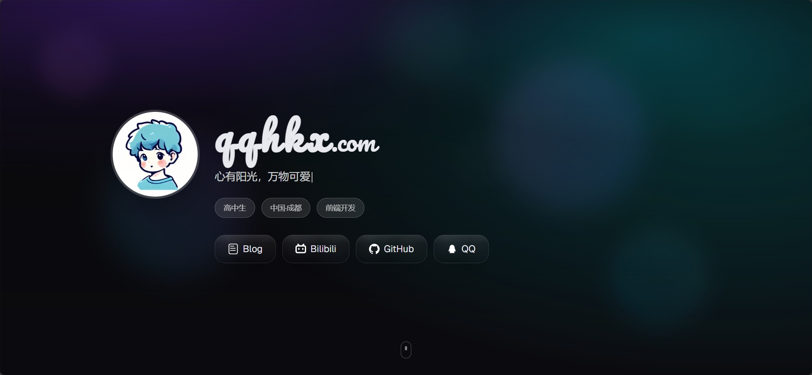

# QQHKX 个人主页

[English](./README.en.md) | 中文

这是一个基于 [Next.js](https://nextjs.org) 构建的现代化个人主页项目，追求"美观且惊艳"的视觉与交互体验。项目采用环境变量配置，支持快速定制，无需修改代码即可打造属于你的个人品牌展示页面。



## ✨ 特性

- 🎨 **现代化设计**：渐变背景、拟物风格卡片、动态光效
- 🎭 **流畅动画**：基于 Framer Motion 的 Spring 动画系统
- 📱 **响应式设计**：完美适配桌面、平板和移动设备
- ⚡ **Next.js 15**：最新版本，支持 App Router 和 Turbopack
- 🎯 **环境变量配置**：零代码修改，纯配置驱动
- 🚀 **一键部署**：完美支持 Vercel 部署

## 🚀 支持的功能

### 📋 个人信息展示
- ✅ **个人头像**：支持远程图片链接，自动优化加载
- ✅ **姓名展示**：支持自定义显示名称
- ✅ **个人座右铭**：打字机效果逐字显示
- ✅ **地理位置**：显示所在城市或地区
- ✅ **职业角色**：展示当前职业或身份
- ✅ **个人简介**：支持模板变量的详细介绍

### 🔗 社交媒体集成
- ✅ **GitHub**：代码仓库展示
- ✅ **QQ**：即时通讯联系
- ✅ **哔哩哔哩**：视频内容分享
- ✅ **个人博客**：文章和思考分享
- ✅ **自定义平台**：支持添加任意社交平台
- ✅ **SVG 图标**：矢量图标，完美适配各种屏幕

### 💻 技能展示
- ✅ **编程语言**：支持多种编程语言标签
- ✅ **框架工具**：展示掌握的技术栈
- ✅ **动态标签**：彩色渐变技能标签
- ✅ **分类管理**：语言与工具分类展示

### 🎨 项目作品集
- ✅ **项目卡片**：精美的项目展示卡片
- ✅ **项目描述**：详细的项目介绍
- ✅ **技术标签**：项目使用的技术栈
- ✅ **外链跳转**：支持 GitHub、演示站点等链接
- ✅ **响应式网格**：自适应的项目布局

### 🎭 动画与交互
- ✅ **Hero 动画**：页面加载时的入场动画
- ✅ **滚动视差**：背景元素的视差滚动效果
- ✅ **打字机效果**：座右铭文字逐字显示
- ✅ **悬停动效**：按钮和卡片的交互反馈
- ✅ **Spring 动画**：基于物理的自然动画
- ✅ **渐进加载**：内容分批次优雅进入

### 🌐 多平台部署
- ✅ **Vercel 部署**：一键部署，自动 HTTPS
- ✅ **Netlify 支持**：静态站点托管
- ✅ **GitHub Pages**：免费的 GitHub 托管
- ✅ **自定义域名**：支持绑定个人域名
- ✅ **CDN 加速**：全球内容分发网络

### ⚙️ 配置与定制
- ✅ **环境变量驱动**：零代码修改，纯配置
- ✅ **模板变量**：支持动态内容替换
- ✅ **主题定制**：可自定义颜色和样式
- ✅ **字体配置**：支持自定义字体文件
- ✅ **图片域名配置**：灵活的图片资源管理

### 📱 响应式设计
- ✅ **移动端优化**：完美适配手机屏幕
- ✅ **平板适配**：中等屏幕的优化布局
- ✅ **桌面端体验**：大屏幕的丰富交互
- ✅ **触摸友好**：移动设备的触摸优化

### 🔍 SEO 与性能
- ✅ **元数据优化**：完整的 SEO 标签
- ✅ **Open Graph**：社交媒体分享优化
- ✅ **图片优化**：Next.js Image 组件自动优化
- ✅ **代码分割**：按需加载，提升性能
- ✅ **静态生成**：预渲染页面，极速加载

### 🛠️ 开发体验
- ✅ **TypeScript 支持**：完整的类型安全
- ✅ **热重载**：开发时实时预览
- ✅ **ESLint 配置**：代码质量保证
- ✅ **环境变量验证**：配置错误提示
- ✅ **开发工具**：丰富的调试和开发辅助

## 🔧 环境变量配置

本项目的核心优势在于**零代码配置**，所有个人信息都通过环境变量管理，让你专注于内容而非代码。

### 快速配置

1. **复制环境变量模板**
   ```bash
   cp .env.example .env.local
   ```

2. **编辑配置文件**
   ```bash
   # 使用你喜欢的编辑器打开
   code .env.local
   # 或者
   notepad .env.local
   ```

3. **重启开发服务器**
   ```bash
   npm run dev
   ```

### 主要配置项

#### 🌐 网站基本信息
| 配置项 | 说明 | 示例 |
|--------|------|------|
| `NEXT_PUBLIC_SITE_TITLE` | 网站标题 | `QQHKX \| 个人主页` |
| `NEXT_PUBLIC_SITE_DESCRIPTION` | 网站描述 | `QQHKX 的个人主页与项目展示` |
| `NEXT_PUBLIC_SITE_URL` | 网站URL | `https://qqhkx.com` |
| `NEXT_PUBLIC_SITE_NAME` | 网站名称（页面显示） | `qqhkx` |
| `NEXT_PUBLIC_SITE_DOMAIN` | 网站域名后缀 | `.com` |

#### 👤 个人信息配置
| 配置项 | 说明 | 示例 |
|--------|------|------|
| `NEXT_PUBLIC_PROFILE_NAME` | 你的姓名 | `qqhkx.com` |
| `NEXT_PUBLIC_PROFILE_MOTTO` | 个人座右铭 | `心有阳光，万物可爱` |
| `NEXT_PUBLIC_PROFILE_LOCATION` | 所在地区 | `中国·成都` |
| `NEXT_PUBLIC_PROFILE_ROLE` | 职业角色 | `高中生` |
| `NEXT_PUBLIC_PROFILE_AVATAR` | 头像链接 | `https://image.qqhkx.com/avatar.jpg` |
| `NEXT_PUBLIC_PROFILE_DESCRIPTION` | 个人简介 | 支持 `{location}` 和 `{role}` 模板变量 |
| `NEXT_PUBLIC_PROFILE_AVATAR_ALT` | 头像alt文本 | `{name} avatar`（支持模板变量） |

#### 🔗 社交与技能配置
| 配置项 | 说明 | 示例 |
|--------|------|------|
| `NEXT_PUBLIC_SOCIALS` | 社交链接 | JSON 格式数组 |
| `NEXT_PUBLIC_LANGUAGES` | 编程语言 | 逗号分隔的字符串 |
| `NEXT_PUBLIC_FRAMEWORKS_AND_TOOLS` | 框架与工具 | 逗号分隔的字符串 |
| `NEXT_PUBLIC_PROJECTS` | 项目展示 | JSON 格式数组 |

#### 🖼️ 图片与资源配置
| 配置项 | 说明 | 示例 |
|--------|------|------|
| `NEXT_PUBLIC_IMAGE_HOSTNAME` | 图片域名 | `image.qqhkx.com` |
| `NEXT_PUBLIC_FAVICON_PATH` | 网站图标 | `https://image.qqhkx.com/favicon.ico` |
| `NEXT_PUBLIC_ICP_NUMBER` | ICP备案号 | `蜀ICP备2024089469号-1` |

📖 **详细配置指南**：[CONFIG_GUIDE.md](./CONFIG_GUIDE.md) | [ENV_CONFIG.md](./ENV_CONFIG.md)

### 配置技巧

- 🖼️ **头像建议**：使用正方形图片，推荐尺寸 400x400 以上
- 🔗 **社交链接**：支持 GitHub、Bilibili、Blog、QQ 等平台自动图标匹配
- 🎨 **图标自定义**：可在 `src/components/SocialIcon.tsx` 中添加新平台图标
- 📱 **响应式测试**：配置完成后记得在不同设备尺寸下测试效果

## 🚀 快速开始

1. **克隆项目**
   ```bash
   git clone https://github.com/qqhkx/qqhkx-homepage.git
   cd qqhkx-homepage
   ```

2. **安装依赖**
   ```bash
   npm install
   ```

3. **配置环境变量**
   ```bash
   cp .env.example .env.local
   # 编辑 .env.local 文件，填入你的个人信息
   ```
   
   💡 **首次配置？** 查看 [配置指南](./CONFIG_GUIDE.md) 获取详细说明和示例

4. **启动开发服务器**
   ```bash
   npm run dev
   ```

5. **访问应用**
   
   打开 [http://localhost:3000](http://localhost:3000) 查看结果。

## 📁 项目结构

```
qqhkx-homepage/
├── src/
│   ├── app/                    # Next.js App Router
│   │   ├── favicon.ico         # 网站图标
│   │   ├── globals.css         # 全局样式
│   │   ├── layout.tsx          # 根布局组件
│   │   └── page.tsx            # 首页组件
│   ├── components/             # React 组件
│   │   └── SocialIcon.tsx      # 社交媒体图标组件
│   └── data/                   # 数据配置
│       └── profile.ts          # 个人信息配置（默认值）
├── public/                     # 静态资源
│   ├── icon/                   # 社交媒体图标
│   │   ├── github.svg          # GitHub 图标
│   │   ├── bilibili.svg        # Bilibili 图标
│   │   ├── blog.svg            # 博客图标
│   │   └── QQ.svg              # QQ 图标
│   └── font/                   # 本地字体
│       └── Pacifico-Regular-all.ttf  # 标题字体
├── .env.example                # 环境变量模板
├── .env.local                  # 本地环境变量（需自行创建）
├── ENV_CONFIG.md               # 环境变量配置指南
├── next.config.ts              # Next.js 配置
├── tailwind.config.ts          # Tailwind CSS 配置
└── tsconfig.json               # TypeScript 配置
```

### 核心文件说明

- **`src/app/page.tsx`**：主页面组件，包含 Hero、关于、技能、项目等区域
- **`src/components/SocialIcon.tsx`**：社交媒体图标组件，支持多平台自动匹配
- **`src/data/profile.ts`**：个人信息默认配置，环境变量优先级更高
- **`.env.local`**：本地环境变量，覆盖默认配置


## 🎨 自定义开发

### 添加新的社交平台

1. **添加图标文件**
   ```bash
   # 将 SVG 图标放入 public/icon/ 目录
   public/icon/your-platform.svg
   ```

2. **更新 SocialIcon 组件**
   ```typescript
   // src/components/SocialIcon.tsx
   const iconMap: Record<string, string> = {
     // ... 现有图标
     "YourPlatform": "/icon/your-platform.svg",
   };
   ```

3. **在环境变量中使用**
   ```bash
   # .env.local
   NEXT_PUBLIC_SOCIALS=[{"name":"YourPlatform","url":"https://your-platform.com/profile"}]
   ```

### 自定义样式

- **修改主题色彩**：编辑 `tailwind.config.ts` 中的颜色配置
- **调整动画效果**：在 `src/app/page.tsx` 中修改 Framer Motion 参数
- **更换字体**：替换 `public/font/` 中的字体文件并更新 `src/app/layout.tsx`

### 添加新页面

```bash
# 创建新页面
mkdir src/app/about
touch src/app/about/page.tsx
```

### 性能优化建议

- 🖼️ **图片优化**：使用 Next.js Image 组件，配置 `remotePatterns`
- 🎭 **动画性能**：避免同时运行过多复杂动画
- 📱 **移动端适配**：使用 Tailwind 的响应式前缀测试各种屏幕尺寸
- ⚡ **构建优化**：运行 `npm run build` 检查包大小和性能指标

## 📦 构建与部署

### 本地构建测试

```bash
# 构建生产版本
npm run build

# 启动生产服务器
npm start

# 或者使用 serve 静态托管
npx serve@latest out
```

### 部署到 Vercel（推荐）

#### 方式一：一键部署
[](https://vercel.com/new/clone?repository-url=https://github.com/qqhkx/qqhkx-homepage)

#### 方式二：GitHub 集成
1. Fork 本仓库到你的 GitHub
2. 在 [Vercel](https://vercel.com) 中导入你的仓库
3. 配置环境变量（见下方说明）
4. 点击部署

#### 方式三：CLI 部署
```bash
# 安装 Vercel CLI
npm i -g vercel

# 登录 Vercel
vercel login

# 部署项目
vercel

# 部署到生产环境
vercel --prod
```

### 环境变量配置

在 Vercel 控制台配置环境变量：

1. 进入项目 Dashboard
2. 点击 **Settings** > **Environment Variables**
3. 添加所需的环境变量（详细配置项请参考上方的[主要配置项](#主要配置项)部分）

### 其他部署平台

#### Netlify
```bash
# 构建命令
npm run build

# 发布目录
out
```

#### GitHub Pages
```bash
# 安装 gh-pages
npm install --save-dev gh-pages

# 添加部署脚本到 package.json
"scripts": {
  "deploy": "gh-pages -d out"
}

# 部署
npm run build && npm run deploy
```

### 故障排除

#### 常见问题

1. **构建失败**
   ```bash
   # 清理缓存重新安装
   rm -rf node_modules package-lock.json
   npm install
   ```

2. **环境变量不生效**
   - 确保变量名以 `NEXT_PUBLIC_` 开头
   - 重启开发服务器
   - 检查 `.env.local` 文件格式

3. **图片加载失败**
   - 检查 `next.config.ts` 中的 `remotePatterns` 配置
   - 确保图片 URL 可访问

4. **字体加载问题**
   - 确保字体文件在 `public/font/` 目录中
   - 检查 `layout.tsx` 中的字体配置

#### 性能检查

```bash
# 分析包大小
npm run build
npx @next/bundle-analyzer

# Lighthouse 性能测试
npx lighthouse http://localhost:3000
```

## 📚 相关资源

- [Next.js 文档](https://nextjs.org/docs) - 了解 Next.js 功能和 API
- [Tailwind CSS 文档](https://tailwindcss.com/docs) - CSS 框架文档
- [Framer Motion 文档](https://www.framer.com/motion/) - 动画库文档
- [Vercel 部署文档](https://vercel.com/docs) - 部署平台文档

## 📈 Star 历史

[](https://star-history.com/#qqhkx/qqhkx-homepage&Date)

## 🤝 贡献

欢迎提交 Issue 和 Pull Request！

## 📄 许可证

[MIT License](LICENSE)

---

⭐ 如果这个项目对你有帮助，请给个 Star！
